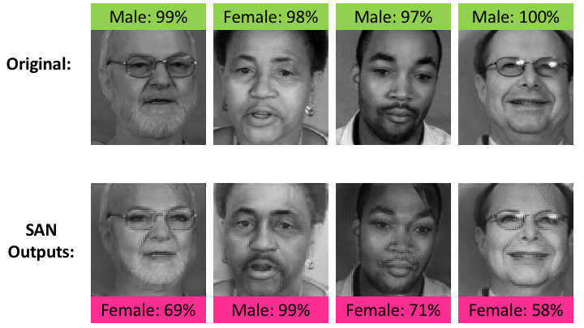
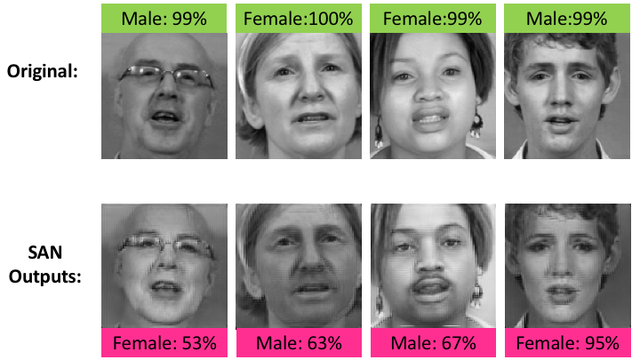

Semi Adversarial Networks (SAN)
=====


## Paper 

[Semi-Adversarial Networks: Convolutional Autoencoders for Imparting Privacy to Face Images](https://arxiv.org/abs/1712.00321), 
[V. Mirjalili](https://github.com/vmirly), [S. Raschka](https://github.com/rasbt), [A. Namboodiri](https://www.iiit.ac.in/people/faculty/anoop/), and [A. Ross](http://www.cse.msu.edu/~rossarun/)


```

```

## Example Inputs/Outputs




